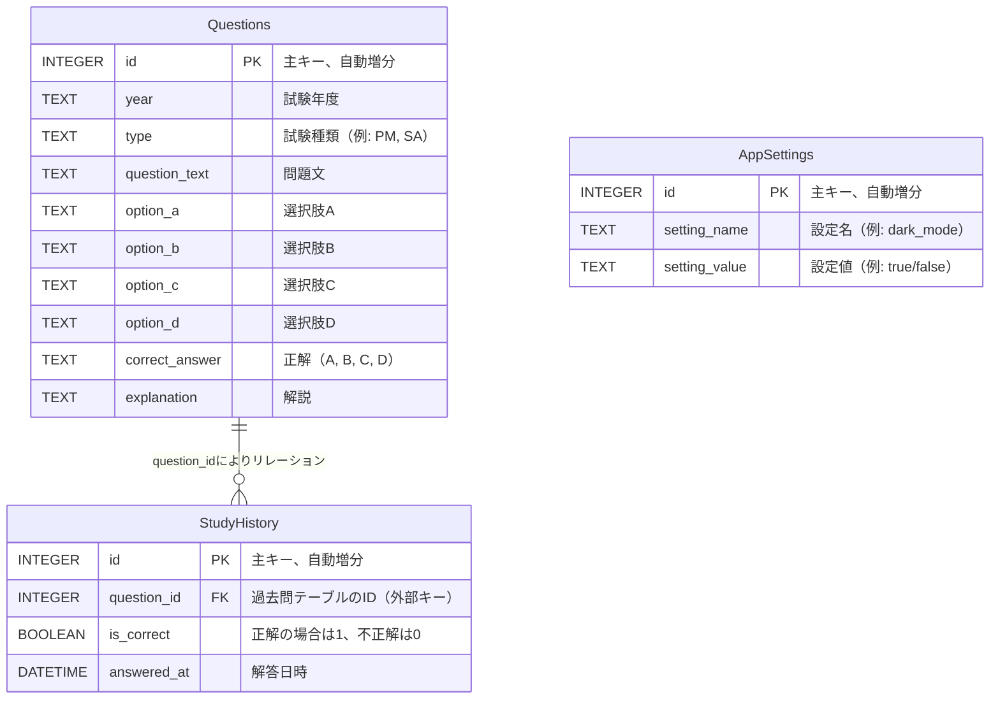

# **データ設計書**

## **1. データ概要**
本アプリでは、以下の3種類のデータを管理します。

1. **過去問データ**  
   各試験の問題文、選択肢、正解、解説などを含む。
2. **学習履歴データ**  
   ユーザーが解答した問題の履歴、正解・不正解、解答日時などを含む。
3. **アプリ設定データ**  
   ダークモードの設定状態などのアプリ設定情報を管理する。

---

## **2. テーブル設計**

### **2.1 過去問テーブル（Questions）**

| カラム名        | データ型    | NOT NULL | 主キー | 説明                        |
|----------------|------------|----------|--------|-----------------------------|
| id             | INTEGER    | YES      | YES    | 主キー、自動増分             |
| year           | TEXT       | YES      |        | 試験年度                    |
| type           | TEXT       | YES      |        | 試験種類（例: PM, SA）       |
| question_text  | TEXT       | YES      |        | 問題文                      |
| option_a       | TEXT       | YES      |        | 選択肢A                     |
| option_b       | TEXT       | YES      |        | 選択肢B                     |
| option_c       | TEXT       | YES      |        | 選択肢C                     |
| option_d       | TEXT       | YES      |        | 選択肢D                     |
| correct_answer | TEXT       | YES      |        | 正解（A, B, C, D）           |
| explanation    | TEXT       | NO       |        | 解説                        |

---

### **2.2 学習履歴テーブル（StudyHistory）**

| カラム名        | データ型    | NOT NULL | 主キー | 説明                        |
|----------------|------------|----------|--------|-----------------------------|
| id             | INTEGER    | YES      | YES    | 主キー、自動増分             |
| question_id    | INTEGER    | YES      |        | 過去問テーブルのID（外部キー）|
| is_correct     | BOOLEAN    | YES      |        | 正解の場合は1、不正解は0     |
| answered_at    | DATETIME   | NO       |        | 解答日時                    |

---

### **2.3 アプリ設定テーブル（AppSettings）**

| カラム名        | データ型    | NOT NULL | 主キー | 説明                        |
|----------------|------------|----------|--------|-----------------------------|
| id             | INTEGER    | YES      | YES    | 主キー、自動増分             |
| setting_name   | TEXT       | YES      |        | 設定名（例: dark_mode）      |
| setting_value  | TEXT       | YES      |        | 設定値（例: true/false）     |

---

## **3. リレーション（関係性）**

- **過去問テーブル（Questions）** と **学習履歴テーブル（StudyHistory）** は、`question_id` をキーとしてリレーションを持ちます。
- **アプリ設定テーブル（AppSettings）** は独立したテーブルであり、リレーションを持ちません。

---

## **4. ER図**



---

## **5. サンプルSQL**

### **5.1 過去問テーブルの作成**

```sql
CREATE TABLE Questions (
    id INTEGER PRIMARY KEY AUTOINCREMENT,
    year TEXT NOT NULL,
    type TEXT NOT NULL,
    question_text TEXT NOT NULL,
    option_a TEXT NOT NULL,
    option_b TEXT NOT NULL,
    option_c TEXT NOT NULL,
    option_d TEXT NOT NULL,
    correct_answer TEXT NOT NULL,
    explanation TEXT
);
```

### **5.2 学習履歴テーブルの作成**

```sql
CREATE TABLE StudyHistory (
    id INTEGER PRIMARY KEY AUTOINCREMENT,
    question_id INTEGER NOT NULL,
    is_correct BOOLEAN NOT NULL,
    answered_at DATETIME DEFAULT CURRENT_TIMESTAMP,
    FOREIGN KEY (question_id) REFERENCES Questions (id)
);
```

### **5.3 アプリ設定テーブルの作成**

```sql
CREATE TABLE AppSettings (
    id INTEGER PRIMARY KEY AUTOINCREMENT,
    setting_name TEXT NOT NULL,
    setting_value TEXT NOT NULL
);
```

---

## **6. サンプルデータ**

### **6.1 過去問データ**

| id  | year | type | question_text         | option_a | option_b | option_c | option_d | correct_answer | explanation              |
|-----|------|------|-----------------------|----------|----------|----------|----------|----------------|---------------------------|
| 1   | 2023 | PM   | プロジェクト管理に関する問題 | A        | B        | C        | D        | A              | プロジェクト管理の基本知識 |
| 2   | 2022 | SA   | システム設計に関する問題     | A        | B        | C        | D        | C              | システム設計の基本知識     |

### **6.2 学習履歴データ**

| id  | question_id | is_correct | answered_at         |
|-----|-------------|------------|---------------------|
| 1   | 1           | 1          | 2025-01-08 10:30:00 |
| 2   | 2           | 0          | 2025-01-08 11:00:00 |

### **6.3 アプリ設定データ**

| id  | setting_name | setting_value |
|-----|--------------|----------------|
| 1   | dark_mode    | true           |

---

### **7 データ設計のポイント**

1. 拡張性を考慮
   - 将来的に新しい試験種類や出題形式を追加する際、既存のデータ構造に大きな変更を加えることなく対応できるよう設計しています。

2. データの正規化
   - 問題データと履歴データを分離することで、冗長なデータを排除し、管理しやすくしています。

3. パフォーマンス
   - `question_id` にインデックスを付与することで、履歴データを効率的に検索可能としています。

