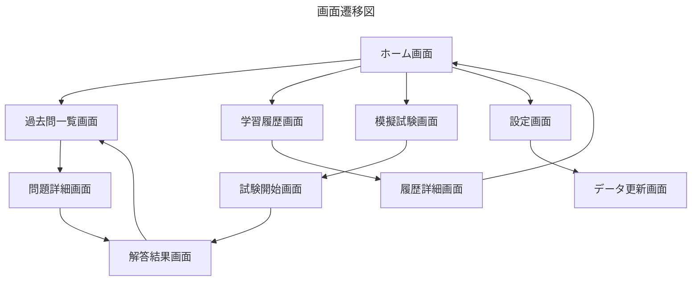

# **画面設計書**

## **1. 画面遷移図**

## **2. ホーム画面**

### 概要
アプリのメインメニュー画面。ユーザーが「過去問一覧」「学習履歴」「模擬試験」「設定」にアクセス可能。

### 画面イメージ
  
*図1: ホーム画面のUI。各メニュー項目をボタンとして配置。*

### 主なUI要素
| UI要素           | 種類          | 説明                              |
|------------------|---------------|-----------------------------------|
| 「過去問一覧」    | ボタン        | 過去問の年度別・試験別リストに遷移 |
| 「学習履歴」      | ボタン        | 学習進捗を表示する画面に遷移      |
| 「模擬試験」      | ボタン        | 模擬試験を開始する画面に遷移      |
| 「設定」          | ボタン        | 設定画面に遷移                    |

---

## **3. 過去問一覧画面**

### 概要
過去問を年度ごと、試験種類ごとにリスト表示する画面。

### 画面イメージ
  
*図2: 過去問一覧画面のUI。年度別に試験を表示し、各セクションにアクセス可能。*

### 主なUI要素
| UI要素             | 種類       | 説明                                      |
|--------------------|------------|-------------------------------------------|
| 「年度ごとの試験タイトル」 | テキスト     | 過去問データが存在する場合のみ年度と試験名を表示 |
| 「午前I」「午後I」ボタン  | ボタン       | 各セクションの過去問に遷移                |
| 戻るボタン           | ボタン       | ホーム画面に戻る                          |

---

## **4. 問題詳細画面**

### 概要
過去問の1問ごとに問題文を表示し、ユーザーが解答できる画面。

### 画面イメージ
（※現在、画像がありません）

### 主なUI要素
| UI要素               | 種類       | 説明                                   |
|----------------------|------------|----------------------------------------|
| 問題文               | テキスト    | 過去問の問題文を表示                   |
| 選択肢（A/B/C/D）     | ラジオボタン | ユーザーが選択肢を選ぶためのボタン     |
| 「解答を送信」ボタン   | ボタン      | 解答を送信し、正誤判定を行う           |
| 戻るボタン            | ボタン      | 過去問一覧画面に戻る                   |

### バリデーション
- 解答が未選択のまま「解答を送信」ボタンが押された場合、「解答を選択してください」とメッセージを表示。

### エラーハンドリング
- データベースから問題を取得できない場合、「データが見つかりません」とメッセージを表示。

### UIフィードバック
- 解答を送信中は「解答を送信中です...」とメッセージを表示し、ボタンを無効化する。

---

## **5. 解答結果画面**

### 概要
ユーザーが選択した解答の結果（正解・不正解）を表示し、正しい解答と解説を確認できる画面。

### 主なUI要素
| UI要素                | 種類       | 説明                                  |
|-----------------------|------------|---------------------------------------|
| 解答結果（○ or ×）     | アイコン    | 正解の場合は○、不正解の場合は×を表示  |
| 正しい解答             | テキスト    | 正しい選択肢を表示                    |
| 解説                   | テキスト    | 問題の解説を表示                      |
| 「次の問題に進む」ボタン | ボタン      | 次の問題に遷移                        |
| 戻るボタン             | ボタン      | 過去問一覧画面に戻る                  |

### バリデーション
- 次の問題が存在しない場合、「次の問題はありません」とメッセージを表示し、「次の問題に進む」ボタンを無効化する。

### UIフィードバック
- 解答結果表示時に正解の場合は緑、不正解の場合は赤で背景色を変更する。

---

## **6. 学習履歴画面**

### 概要
ユーザーの学習進捗を可視化する画面。総合進捗や分野別の正答率を表示。

### 画面イメージ
  
*図3: 学習履歴画面のUI。総合進捗と分野別正答率をグラフで表示。*

### 主なUI要素
| UI要素               | 種類    | 説明                                 |
|----------------------|---------|--------------------------------------|
| 総合進捗バー          | プログレスバー | 全体の進捗状況をバーで表示            |
| 分野別正答率グラフ     | 棒グラフ      | 各分野ごとの正答率をグラフで表示      |
| 戻るボタン            | ボタン       | ホーム画面に戻る                     |

---

## **7. 模擬試験画面**

### 概要
模擬試験を開始する画面。試験種類ごとに模擬試験を選択可能。

### 画面イメージ
  
*図4: 模擬試験画面のUI。試験ごとに模擬試験を開始可能。*

### 主なUI要素
| UI要素                   | 種類       | 説明                                   |
|--------------------------|------------|----------------------------------------|
| 「プロジェクトマネージャ模擬試験」 | ボタン       | プロジェクトマネージャの模擬試験を開始 |
| 「システムアーキテクト模擬試験」   | ボタン       | システムアーキテクトの模擬試験を開始   |
| 戻るボタン                | ボタン       | ホーム画面に戻る                       |

### 操作ガイド
- 試験開始前に「試験時間は○○分です。途中で終了することはできません」とメッセージを表示。

---

## **8. 設定画面**

### 概要
アプリの設定やデータ更新を行う画面。

### 画面イメージ
  
*図5: 設定画面のUI。ダークモードの切り替えとデータ更新機能を提供。*

### 主なUI要素
| UI要素             | 種類      | 説明                                    |
|--------------------|-----------|-----------------------------------------|
| ダークモード切替    | スイッチ   | ダークモードをオン/オフ                 |
| 「データを更新する」ボタン | ボタン     | 最新の過去問データをダウンロードして更新 |
| 戻るボタン          | ボタン     | ホーム画面に戻る                        |

### バリデーション
- データ更新時にネットワーク接続がない場合、「ネットワーク接続を確認してください」とメッセージを表示。

### エラーハンドリング
- 更新中に失敗した場合、「更新に失敗しました。時間を置いて再度お試しください」とメッセージを表示。

---

## **9. UIフィードバック**

| 処理           | フィードバック内容                                | 処理                                                |
|----------------|---------------------------------------------------|----------------------------------------------------|
| データ更新完了 | データ更新が成功した場合                           | 「データが正常に更新されました」とメッセージを表示  |
| 解答送信中     | 解答を送信する際の処理中表示                       | 「解答を送信中です...」とメッセージを表示          |
| 解答送信完了   | 解答が送信され、結果が表示された際                 | 「解答が完了しました。結果を確認してください」とメッセージを表示 |
