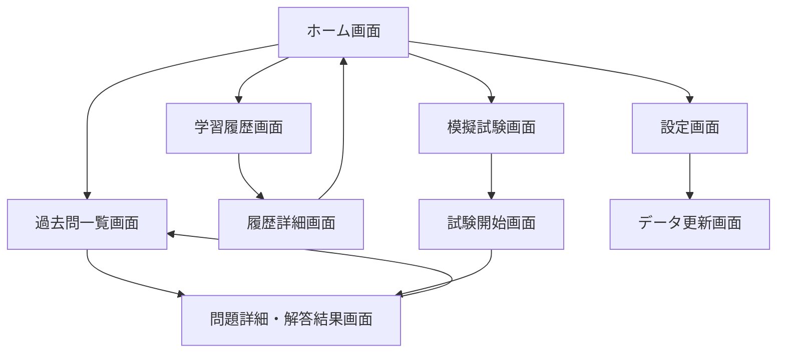
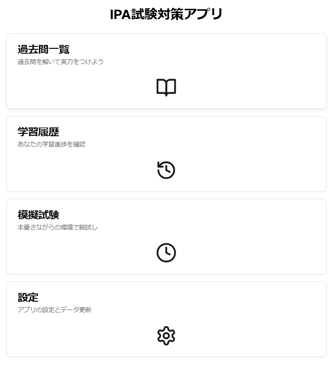
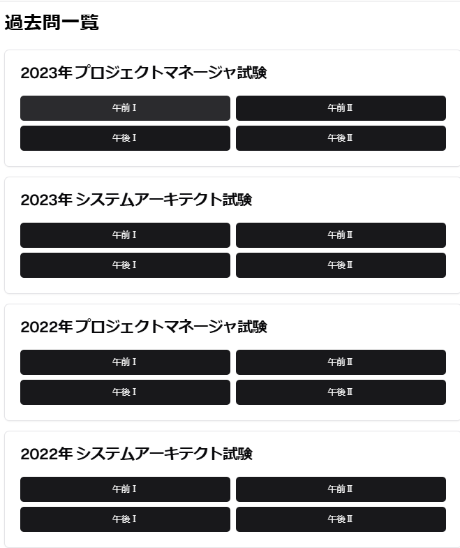
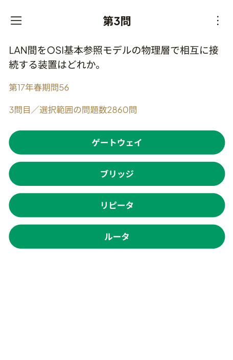
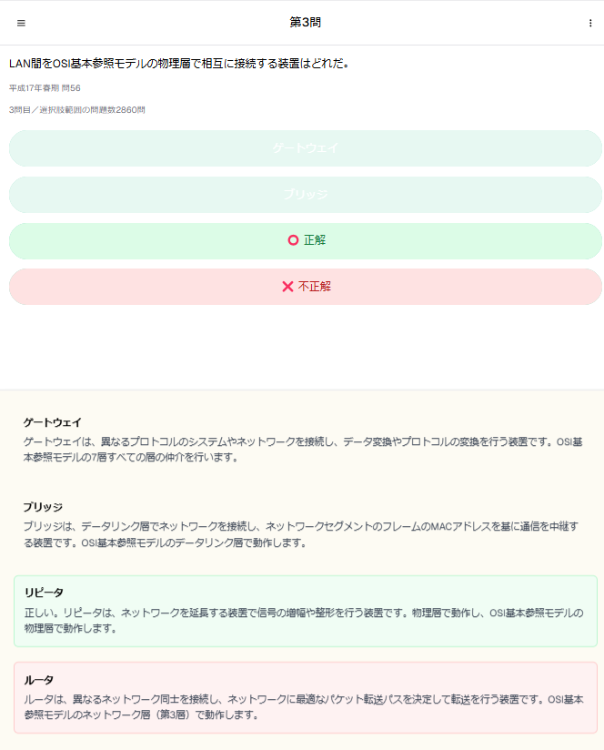
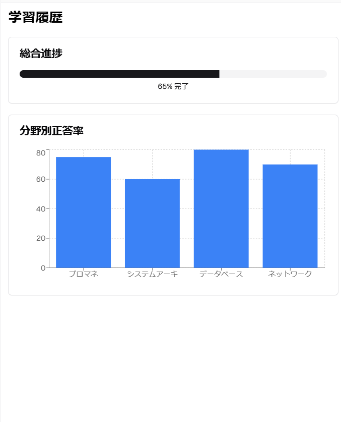
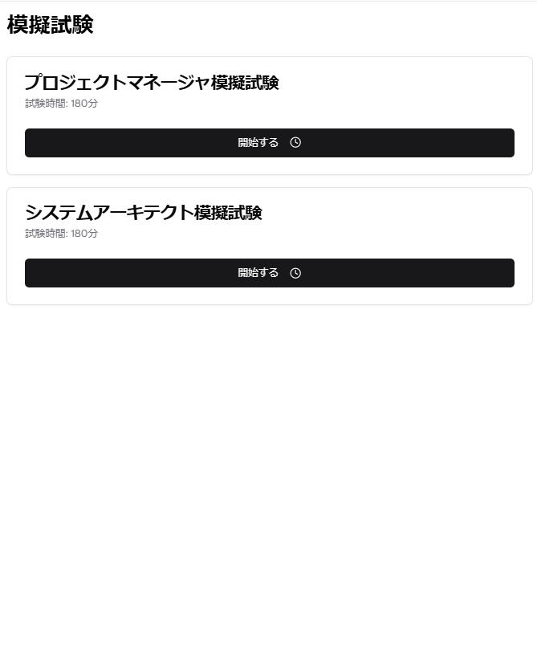
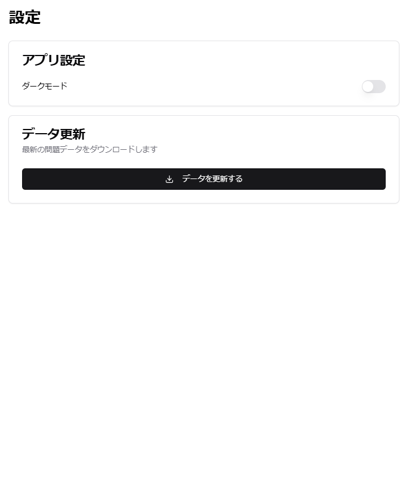

# **画面設計書**

## **1. 画面遷移図**

---
## **2. ホーム画面**

### **概要**
アプリのメインメニュー画面。ユーザーが「過去問一覧」「学習履歴」「模擬試験」「設定」にアクセス可能。

### **画面イメージ**
  
*図1: ホーム画面のUI。各メニュー項目をボタンとして配置。*

### **主なUI要素**

| UI要素           | 種類          | 説明                              |
|------------------|---------------|-----------------------------------|
| 「過去問一覧」    | ボタン        | 過去問の年度別・試験別リストに遷移 |
| 「学習履歴」      | ボタン        | 学習進捗を表示する画面に遷移      |
| 「模擬試験」      | ボタン        | 模擬試験を開始する画面に遷移      |
| 「設定」          | ボタン        | 設定画面に遷移                    |

---

## **3. 過去問一覧画面**

### **概要**
過去問を年度ごと、試験種類ごとにリスト表示する画面。

### **画面イメージ**
  
*図2: 過去問一覧画面のUI。年度別に試験を表示し、各セクションにアクセス可能。*

### **主なUI要素**

| UI要素             | 種類       | 説明                                      |
|--------------------|------------|-------------------------------------------|
| 「年度ごとの試験タイトル」 | テキスト     | 過去問データが存在する場合のみ年度と試験名を表示 |
| 「午前I」「午後I」ボタン  | ボタン       | 各セクションの過去問に遷移                |
| 戻るボタン           | ボタン       | ホーム画面に戻る                          |

---

## **4. 問題詳細・解答結果画面**

### **概要**
過去問を1問ずつ解答し、結果を確認できる画面。

### **画面イメージ**
#### 問題解答前
  
*図3: 問題詳細画面のUI。ユーザーが選択肢を選び、解答を送信できる。*

#### 解答送信後（結果表示）
  
*図4: 解答結果画面のUI。ユーザーが解答の正誤結果と解説を確認できる。*

### **主なUI要素**

| UI要素               | 種類       | 説明                                   |
|----------------------|------------|----------------------------------------|
| 問題文               | テキスト    | 過去問の問題文を表示                   |
| 選択肢（A/B/C/D）     | ラジオボタン | ユーザーが選択肢を選ぶためのボタン     |
| 解答結果（○ or ×）     | アイコン    | 正解の場合は○、不正解の場合は×を表示  |
| 正しい解答             | テキスト    | 正しい選択肢を表示                    |
| 解説                   | テキスト    | 問題の解説を表示                      |
| 「次の問題に進む」ボタン | ボタン      | 次の問題に遷移                        |
| 戻るボタン            | ボタン      | 過去問一覧画面に戻る                   |

### **バリデーション**

| 項目               | 条件                      | 処理                                                  |
|--------------------|---------------------------|-------------------------------------------------------|
| 解答選択           | 未選択状態                | 「解答を選択してください」とメッセージを表示           |
| 次の問題遷移       | 次の問題が存在しない場合  | 「次の問題はありません」とメッセージを表示し、ボタン無効化 |

### **エラーハンドリング**

| エラー内容          | 処理                                                |
|---------------------|-----------------------------------------------------|
| 結果取得エラー      | 「結果の取得に失敗しました」とメッセージを表示       |
| 次の問題取得エラー  | 「次の問題の取得に失敗しました」とメッセージを表示   |

### **UIフィードバック**

| 処理                | フィードバック内容                                      |
|---------------------|--------------------------------------------------------|
| 解答送信中          | プログレスインジケータを表示し、処理中を明示           |
| 解答結果表示        | 正解の場合は緑色、不正解の場合は赤色で背景色を変更    |
| 次の問題取得中      | プログレスインジケータを表示し、処理中を明示           |

---

## **5. 学習履歴画面**

### **概要**
ユーザーの学習進捗を可視化する画面。総合進捗や分野別の正答率を表示。

### **画面イメージ**
  
*図5: 学習履歴画面のUI。総合進捗と分野別正答率をグラフで表示。*

### **主なUI要素**

| UI要素               | 種類           | 説明                                 |
|----------------------|----------------|--------------------------------------|
| 総合進捗バー          | プログレスバー  | 全体の進捗状況をバーで表示            |
| 分野別正答率グラフ     | 棒グラフ       | 各分野ごとの正答率をグラフで表示      |
| 戻るボタン            | ボタン         | ホーム画面に戻る                     |

---

## **6. 模擬試験画面**

### **概要**
模擬試験を開始する画面。試験種類ごとに模擬試験を選択可能。

### **画面イメージ**
  
*図6: 模擬試験画面のUI。試験ごとに模擬試験を開始可能。*

### **主なUI要素**

| UI要素                   | 種類       | 説明                                   |
|--------------------------|------------|----------------------------------------|
| 「プロジェクトマネージャ模擬試験」 | ボタン       | プロジェクトマネージャの模擬試験を開始 |
| 「システムアーキテクト模擬試験」   | ボタン       | システムアーキテクトの模擬試験を開始   |
| 戻るボタン                | ボタン       | ホーム画面に戻る                       |

---

## **7. 設定画面**

### **概要**
アプリの設定やデータ更新を行う画面。

### **画面イメージ**
  
*図7: 設定画面のUI。ダークモードの切り替えとデータ更新機能を提供。*

### **主なUI要素**

| UI要素             | 種類      | 説明                                    |
|--------------------|-----------|-----------------------------------------|
| ダークモード切替    | スイッチ   | ダークモードをオン/オフ                 |
| 「データを更新する」ボタン | ボタン     | 最新の過去問データをダウンロードして更新 |
| 戻るボタン          | ボタン     | ホーム画面に戻る                        |

### **バリデーション**

| 項目                  | 条件                      | 処理                                                |
|-----------------------|---------------------------|-----------------------------------------------------|
| データ更新            | ネットワーク接続なし      | 「ネットワーク接続を確認してください」とメッセージを表示 |

### **エラーハンドリング**

| エラー内容            | 処理                                                |
|----------------------|-----------------------------------------------------|
| データ更新失敗        | 「更新に失敗しました。時間を置いて再度お試しください」と表示 |

---

## **8. UIフィードバック**

| 処理           | フィードバック内容                                |
|----------------|---------------------------------------------------|
| データ更新完了 | データ更新が成功した場合                           |
| 解答送信中     | 解答を送信する際の処理中表示                       |
| 解答送信完了   | 解答が送信され、結果が表示された際                 |
