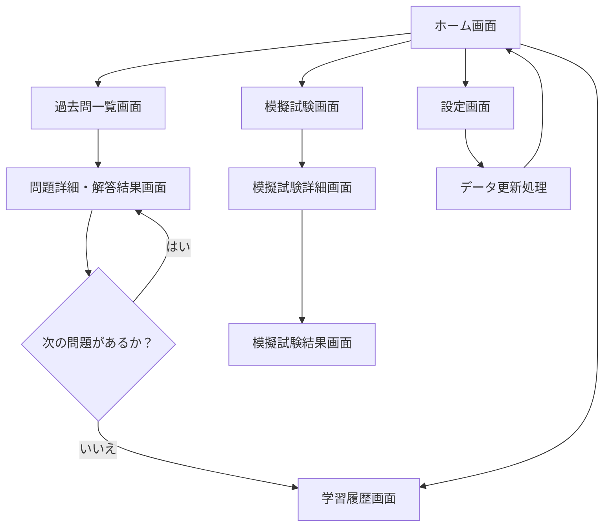
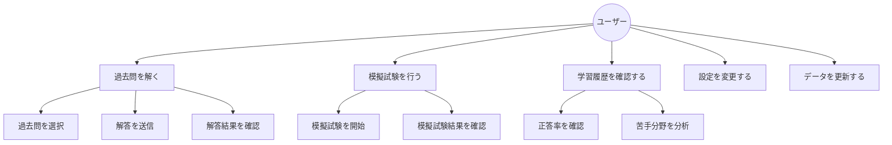

# **要件定義書**

## **1. 解決したい課題**

### **1.1 どんな課題を解決したいか**
- IPA試験「プロジェクトマネージャ」「システムアーキテクト」などの過去問を簡単に勉強できる環境を提供したい。
- 試験対策に必要な情報を簡単に収集し、自分の進行状況を管理できるようにする。
- オフライン環境で通勤中にも快適に勉強できる仕組みを提供したい。

### **1.2 なぜその課題に着目したか**
- 既存の試験対策アプリは多くがサーバーを使用するため、オフラインで利用できるローカル環境で勉強したかった。
- 通勤時間など、短時間でも効率的に勉強を進められる方法を求めていた。

---

## **2. 想定ユーザー**

### **2.1 どんな人に使ってもらいたいか**
- IPA試験を目指す人、特にプロジェクトマネージャやシステムアーキテクトを受験しようとする人。

### **2.2 その人たちがどんな状況で使うか**
- 電車やバスなどの通勤中に、短時間で効率的に過去問を解きたい場合。
- 試験対策に必要な情報を簡単に収集し、自分の進行状況を管理する際。
- 過去問を解き、統計や欠点分析を後で確認したい際。

---

## **3. 提供したい価値**

### **3.1 このアプリで実現したいこと**
- IPA試験の過去問対策を効率的に行える環境の提供。
- 自分の欠点を簡単に見つけられる機能の提供。
- 完全オフラインで利用可能なため、通勤中でも快適に学習可能。

### **3.2 ユーザーにとってのメリット**
- 効率的に過去問対策が行えるため、実力上昇が期待できる。
- 使用環境を選ばず勉強可能。
- データ更新が手動のため、シンプルかつ安定した運用が可能。

### **3.3 既存の解決方法との違い**
- 既存の対策アプリはサーバーベースのものが多く、オフラインでの利用が難しい。
- 本アプリはローカル環境で完結するため、安定した利用が可能。

---

## **4. 機能要件**

### **4.1 基本機能**
- 過去問の閲覧・解答機能
- 正誤判定と結果表示
- 学習履歴の記録と統計表示

### **4.2 応用機能**
- 分析レポート機能（苦手分野の特定）
- 試験範囲別の問題検索機能
- タイマー機能（模擬試験モード）

### **4.3 オフライン対応**
- すべてのデータを端末内に保存し、完全オフラインで動作。

### **4.4 データ更新**
- **手動更新方式**  
  - 開発者が新しいデータを準備し、アプリの更新版を配布。
  - ユーザーはアプリを更新（再インストール）することで新しいデータが反映。
  - 更新頻度: 必要に応じて不定期（例: 新しい年度の過去問リリース時）。

---

## **5. 非機能要件**
- シンプルで直感的なUI/UXデザイン
- 高速な処理と安定性
- データ容量を最小限に抑える設計

---

## **6. 業務フロー図**

---

## **7. ユースケース図**

