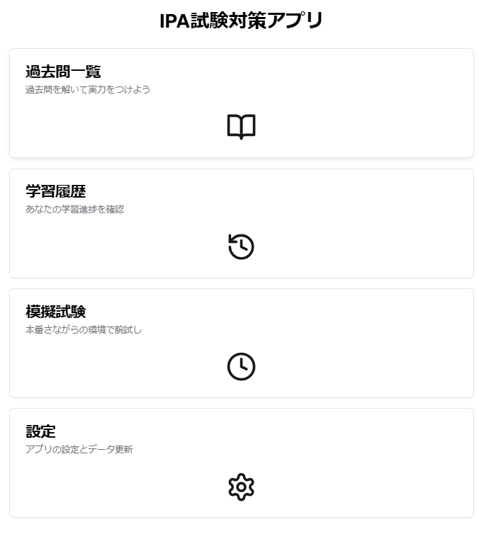
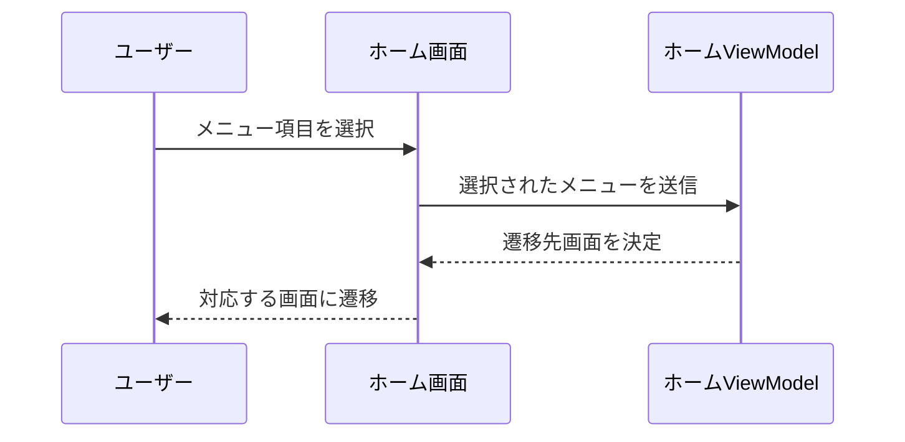

# **詳細設計書: ホーム画面**

## 1. 概要
ホーム画面は、アプリのメインメニュー画面です。ユーザーが「過去問一覧」「学習履歴」「模擬試験」「設定」にアクセスすることができます。

---

## 2. 画面構成

### **2.1 画面イメージ**

  
*図1: ホーム画面のUI。各メニュー項目をボタンとして配置。*

### **2.2 UI要素一覧**

| UI要素           | 種類          | 説明                              |
|------------------|---------------|-----------------------------------|
| 「過去問一覧」    | ボタン        | 過去問の年度別・試験別リストに遷移 |
| 「学習履歴」      | ボタン        | 学習進捗を表示する画面に遷移      |
| 「模擬試験」      | ボタン        | 模擬試験を開始する画面に遷移      |
| 「設定」          | ボタン        | 設定画面に遷移                    |

---

## 3. 機能仕様

### **3.1 機能一覧**

| 機能名            | 詳細                                                |
|-------------------|-----------------------------------------------------|
| 過去問一覧遷移     | 「過去問一覧」ボタンを押すと、過去問一覧画面に遷移する |
| 学習履歴遷移       | 「学習履歴」ボタンを押すと、学習履歴画面に遷移する   |
| 模擬試験遷移       | 「模擬試験」ボタンを押すと、模擬試験画面に遷移する   |
| 設定画面遷移       | 「設定」ボタンを押すと、設定画面に遷移する           |

---

## 4. データ仕様

### **4.1 入出力データ**

- **入力データ**: 特になし（静的データを表示する画面）
- **出力データ**: 選択されたメニュー項目に基づく画面遷移情報

---

## 5. 処理フロー

### **5.1 メニュー選択処理**

---
## **6. バリデーション**

| 項目        | 条件                  | 処理                                     |
|-------------|-----------------------|------------------------------------------|
| メニュー選択 | 無効な選択肢の場合    | 「無効なメニューです」とメッセージを表示 |

---

## **7. エラーハンドリング**

| エラー内容         | 処理                                               |
|--------------------|----------------------------------------------------|
| データ取得エラー    | 「データを取得できません。再度お試しください」と表示 |

---

## **8. UIフィードバック**

| 処理             | フィードバック内容                                |
|------------------|--------------------------------------------------|
| メニュー選択      | 選択されたボタンをハイライトし、選択中を明示する |
| 遷移処理中        | プログレスインジケータを表示し、処理中を明示     |
