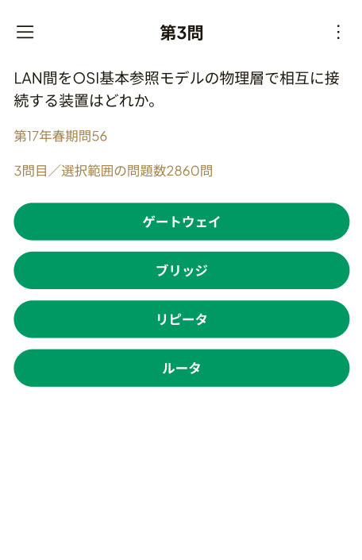
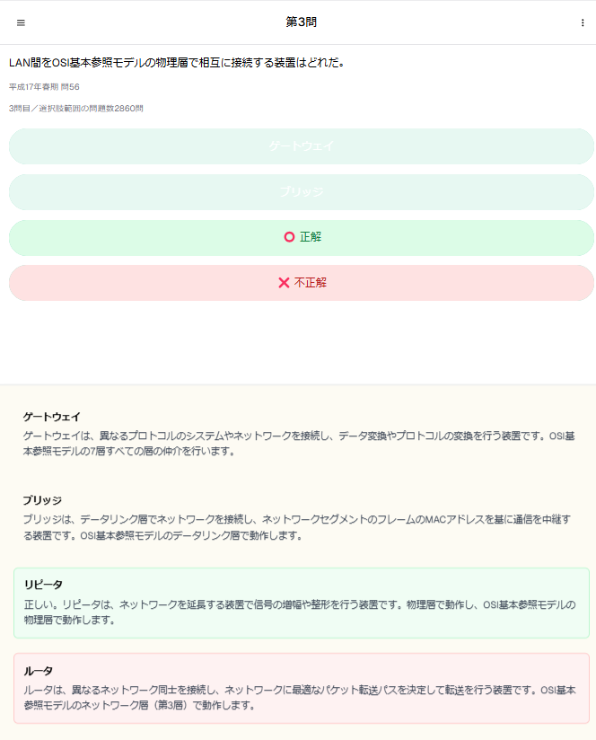
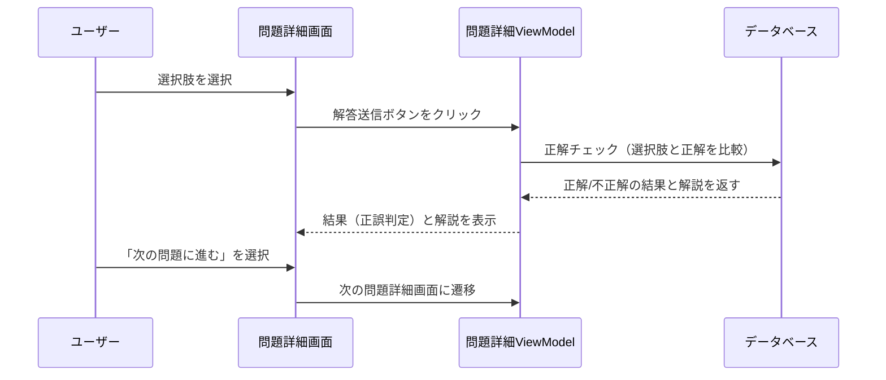

# **詳細設計書: 問題詳細画面（解答結果統合版）**

## **1. 概要**
問題詳細画面は、ユーザーが過去問を1問ずつ解答する画面です。  
解答送信後、同じ画面上で正解・不正解の結果を表示し、正しい解答と解説を確認することができます。

---

## **2. 画面構成**

### **2.1 画面イメージ**

- **回答前の状態（問題文と選択肢のみ表示）**  
    
  *図1: 問題詳細画面（回答前の状態）*

- **回答後の状態（正解・不正解の結果と解説を表示）**  
    
  *図2: 問題詳細画面（回答後の状態）*

---

### **2.2 UI要素一覧**

| UI要素               | 種類           | 説明                                   |
|----------------------|----------------|----------------------------------------|
| 問題文               | テキスト        | 過去問の問題文を表示                   |
| 選択肢（A/B/C/D）     | ボタン          | ユーザーが解答を選択できるボタン       |
| 「解答を送信」ボタン   | ボタン          | ユーザーが選択肢を選んだ後に送信するボタン |
| 解答結果（○ or ×）    | アイコン        | 正解の場合は○、不正解の場合は×を表示  |
| 正しい解答            | テキスト        | 正しい選択肢を表示                    |
| 解説                  | テキスト        | 問題の解説を表示                      |
| 「次の問題に進む」ボタン| ボタン          | 次の問題に遷移                        |
| 戻るボタン            | ボタン          | 過去問一覧画面に戻る                  |

---

## **3. 機能仕様**

### **3.1 機能一覧**

| 機能名               | 詳細                                                 |
|----------------------|------------------------------------------------------|
| 問題表示              | データベースから問題文と選択肢を読み込み、表示する    |
| 解答送信              | ユーザーが選択肢を選んだ後、「解答を送信」ボタンで正誤判定を行う |
| 結果表示              | 解答の正誤を判定し、結果と解説を表示する             |
| 次の問題への遷移       | 「次の問題に進む」ボタンを押すと、次の問題詳細画面に遷移 |
| 戻る処理              | 戻るボタンを押した際に過去問一覧画面に戻る            |

---

## **4. データ仕様**

### **4.1 入出力データ**

- **入力データ**  
  データベースから取得する過去問データ（`Questions` テーブル）

  | フィールド名        | データ型    | 説明                              |
  |--------------------|------------|-----------------------------------|
  | id                 | INTEGER    | 問題のID                         |
  | question_text      | TEXT       | 問題文                            |
  | option_a           | TEXT       | 選択肢A                          |
  | option_b           | TEXT       | 選択肢B                          |
  | option_c           | TEXT       | 選択肢C                          |
  | option_d           | TEXT       | 選択肢D                          |
  | correct_answer     | TEXT       | 正しい選択肢（例: A, B, C, D）   |
  | explanation        | TEXT       | 問題の解説                       |

- **出力データ**  
  ユーザーが選択した解答と、正解/不正解の判定結果を表示します。

---

## **5. 処理フロー**

### **5.1 解答送信と結果表示処理**

---

## **6. バリデーション**

| 項目        | 条件                      | 処理                                                |
|-------------|---------------------------|----------------------------------------------------|
| 解答選択     | 未選択状態                | 「解答を選択してください」とメッセージを表示し、ボタンを無効化 |
| 次の問題遷移 | 次の問題が存在しない場合  | 「次の問題はありません」とメッセージを表示し、ボタンを無効化 |

---

## **7. エラーハンドリング**

| エラー内容          | 処理                                                |
|---------------------|-----------------------------------------------------|
| 結果取得エラー       | 「結果の取得に失敗しました」とメッセージを表示       |
| 次の問題取得エラー   | 「次の問題の取得に失敗しました」とメッセージを表示   |

---

## **8. UIフィードバック**

| 処理               | フィードバック内容                                   |
|--------------------|-----------------------------------------------------|
| 解答送信中          | プログレスインジケータを表示し、処理中を明示        |
| 結果表示            | 正解の場合は緑色、不正解の場合は赤色で背景色を変更 |
| 次の問題取得中      | プログレスインジケータを表示し、処理中を明示        |
