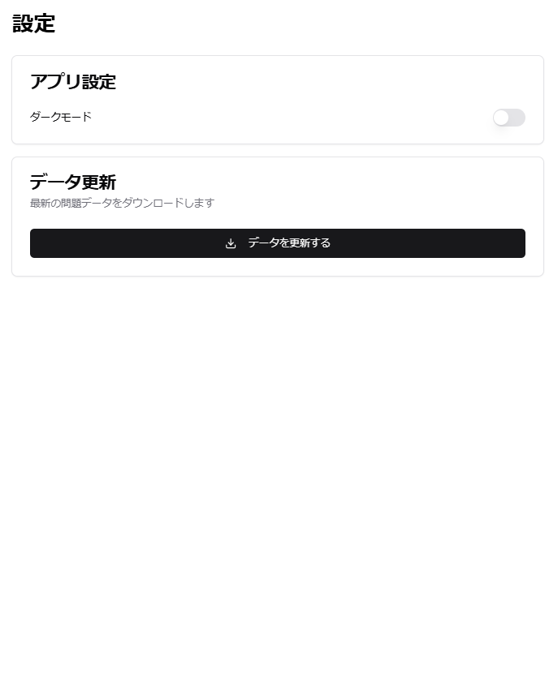
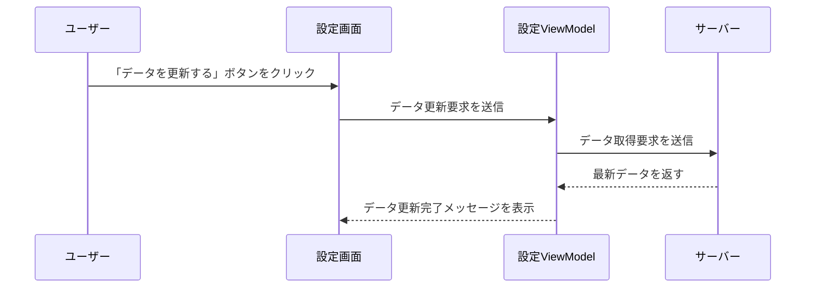

# **詳細設計書: 設定画面**

## **1. 概要**
設定画面は、アプリの基本設定を変更したり、データ更新を行うための画面です。

---

## **2. 画面構成**

### **2.1 画面イメージ**
  
*図7: 設定画面のUI。ダークモードの切り替えとデータ更新機能を提供。*

---

### **2.2 UI要素一覧**

| UI要素               | 種類         | 説明                                         |
|----------------------|--------------|----------------------------------------------|
| ダークモード切替      | スイッチ      | ダークモードをオン/オフするためのトグルスイッチ |
| 「データを更新する」ボタン | ボタン        | 最新の過去問データをダウンロードして更新       |
| 戻るボタン            | ボタン        | ホーム画面に戻る                             |

---

## **3. 機能仕様**

### **3.1 機能一覧**

| 機能名               | 詳細                                                 |
|----------------------|------------------------------------------------------|
| ダークモード切替      | ユーザーがスイッチを操作することで、UIテーマを切り替える |
| データ更新            | ユーザーが「データを更新する」ボタンを押すとデータを更新 |
| 戻る処理              | 戻るボタンを押した際にホーム画面に戻る                |

---

## **4. データ仕様**

### **4.1 入出力データ**
- **入力データ**:  
  ダークモード設定（`Settings` テーブル）  
  データ更新状態（`DataStatus` テーブル）

  | フィールド名        | データ型    | 説明                        |
  |--------------------|------------|-----------------------------|
  | theme_mode         | BOOLEAN    | ダークモードのON/OFF状態    |
  | last_update        | DATETIME   | 最後にデータが更新された日時 |

- **出力データ**:  
  設定内容の保存、データ更新の成否。

---

## **5. 処理フロー**

### **5.1 データ更新処理**

---

## **6. バリデーション**

| 項目         | 条件                 | 処理                                                   |
|--------------|----------------------|--------------------------------------------------------|
| データ更新   | ネットワーク接続なし | 「ネットワーク接続を確認してください」とメッセージを表示 |

---

## **7. エラーハンドリング**

| エラー内容     | 処理                                                   |
|----------------|--------------------------------------------------------|
| データ更新失敗 | 「更新に失敗しました。時間を置いて再度お試しください」と表示 |

---

## **8. UIフィードバック**

| 処理           | フィードバック内容                                        |
|----------------|---------------------------------------------------------|
| データ更新中    | プログレスインジケータを表示し、処理中であることを明示   |
| データ更新完了  | 「データが正常に更新されました」とメッセージを表示       |
