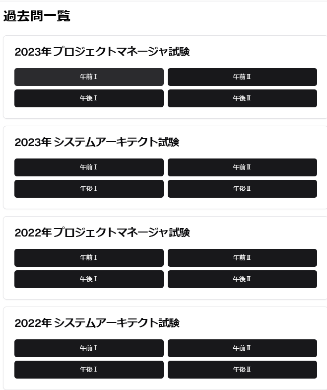
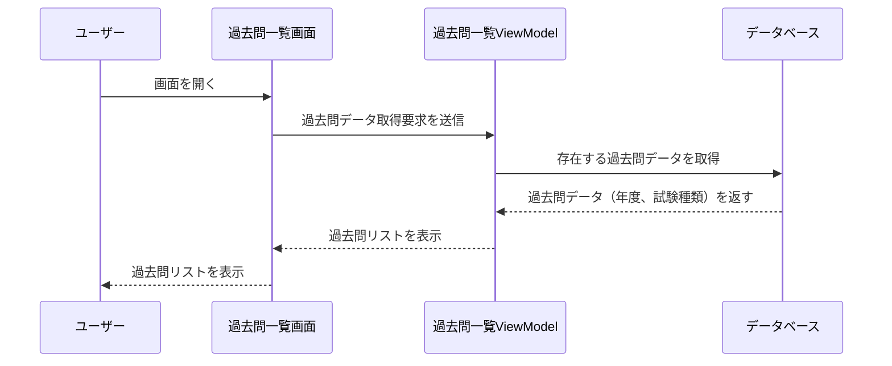

# **詳細設計書: 過去問一覧画面**

## **1. 概要**
過去問一覧画面は、ユーザーが年度や試験種類ごとに過去問を検索・絞り込みし、選択した問題を「問題詳細画面」に遷移するための画面です。

---

## **2. 画面構成**

### **2.1 画面イメージ**



*図1: 過去問一覧画面のUI。年度別に試験を表示し、各セクションにアクセス可能。*

---

### **2.2 UI要素一覧**

| UI要素             | 種類           | 説明                                      |
|--------------------|----------------|-------------------------------------------|
| 過去問タイトル       | テキスト        | 過去問の年度および試験名を表示            |
| セクションボタン     | ボタン          | 各試験の「午前I」「午後I」「午前II」「午後II」に対応 |
| 戻るボタン          | ボタン          | ホーム画面に戻る                          |

---

## **3. 機能仕様**

### **3.1 機能一覧**

| 機能名               | 詳細                                                 |
|----------------------|------------------------------------------------------|
| 過去問の読み込み      | データベースから過去問を読み込み、リストに表示する    |
| セクション選択        | ユーザーがセクションボタンを選択し、問題詳細画面に遷移 |
| 戻る処理              | 戻るボタンを押した際にホーム画面に戻る                |

---

## **4. データ仕様**

### **4.1 入出力データ**

- **入力データ**  
  データベースから取得する過去問データ（`Questions` テーブル）。  
  この時、**過去問データが存在する年度・試験種類のみを取得**するクエリを使用します。

  | フィールド名        | データ型    | 説明                        |
  |--------------------|------------|-----------------------------|
  | id                 | INTEGER    | 過去問のID                   |
  | year               | TEXT       | 試験年度                    |
  | type               | TEXT       | 試験種類                    |

- **データ取得クエリ例**

```sql
SELECT DISTINCT year, type FROM Questions ORDER BY year DESC;
- **出力データ**  
  選択された過去問IDとセクションを「問題詳細画面」に渡す。
```

---

## **5. 処理フロー**

### **5.1 セクション選択処理**



---

# **詳細設計書: 過去問一覧画面**

## **6. バリデーション**

| 項目                  | 条件                      | 処理                                                |
|-----------------------|---------------------------|----------------------------------------------------|
| 年度選択ドロップダウン | 未選択状態                | 「年度を選択してください」とメッセージを表示        |
| 試験種類選択ドロップダウン | 未選択状態                | 「試験種類を選択してください」とメッセージを表示    |
| 過去問リスト           | データベースからデータがない場合 | 「該当する過去問が見つかりません」とメッセージを表示 |

---

## **7. エラーハンドリング**

| エラー内容            | 処理                                                |
|----------------------|----------------------------------------------------|
| データベース接続失敗   | 「データを取得できません。再度お試しください」と表示 |
| データ取得エラー       | 「過去問の読み込みに失敗しました」と表示            |

---

## **8. UIフィードバック**

| 処理                  | フィードバック内容                                   |
|----------------------|-----------------------------------------------------|
| データ取得中           | プログレスインジケータを表示し、処理中であることを明示 |
| 絞り込み中             | プログレスインジケータを表示                        |
| 絞り込み後データなし   | 「該当する過去問が見つかりません」とメッセージを表示 |
